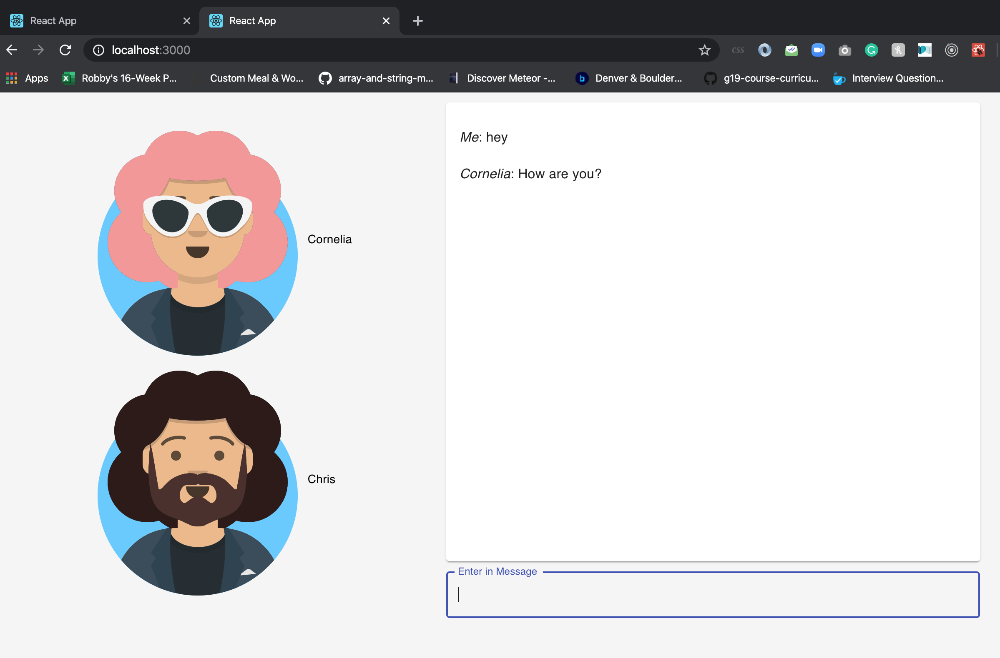

## To Run

Clone this repo and run:
`npm i` - to install the node modules
and then `npm start` - to kick off the application.

You should expect to see the project in your browser at `http://localhost:3000` and a Node.js service running on `http://localhost:4000`

## Using the App

- start in browser window pointed at `localhost:3000` and you will be given a name and avatar
- open another window accessing `localhost:3000` and you will be able to chat between browsers
- add some message inputs and hit the `Enter` key

## Tools Used

- This project was created with [Create React App](https://github.com/facebookincubator/create-react-app).
- [React](https://github.com/facebook/react)
- [Redux](https://github.com/reduxjs/redux)
- [Redux Saga](https://redux-saga.js.org/)
- [Recompose](https://github.com/acdlite/recompose)
- [Redux-Actions](https://github.com/redux-utilities/redux-actions)
- [Material-UI](https://github.com/mui-org/material-ui)
- [Node.js](https://nodejs.org/en/)
- [Web Sockets](https://github.com/websockets/ws)

#### Developement Tools

- [Prettier](https://github.com/prettier/prettier)
- [Concurrently](https://github.com/kimmobrunfeldt/concurrently)

## Additional Thoughts

Here's a list of ideas that would make this application worthy of production.

- Setup a DB to store messages
  - A relational DB could be alright but if we wanted to scale
  - The model could use a timestamp and might consider a concept of rooms/chats with specific ids
- Select a host - maybe something quick and easy like heroku at first
  - Setup pipelines for easy deployment process
- Figure out logging
- Setup user authentication
- More tests and more complete tests
- Spend more time on UI/UX design
- Use a router
